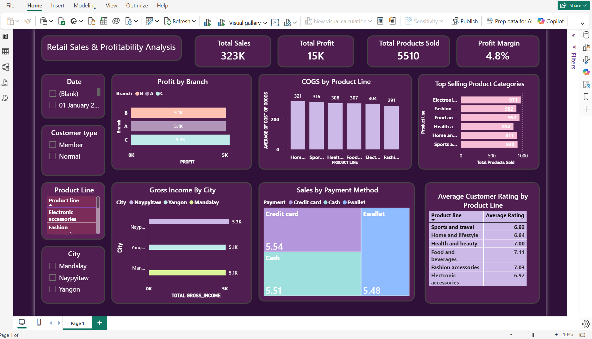
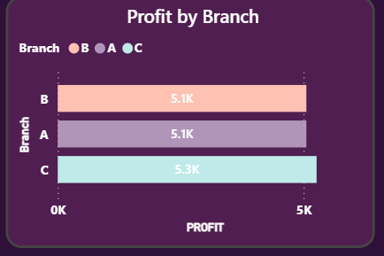
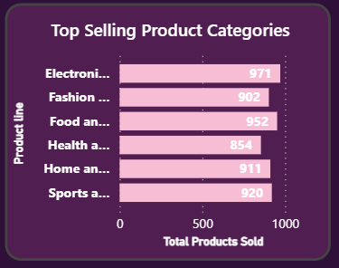
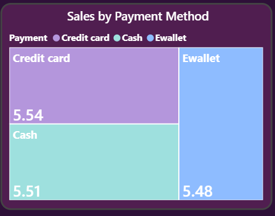

# Retail Sales & Profitability Analysis Dashboard

This project analyzes supermarket retail transactions to understand sales performance, profitability, and customer purchasing behavior.  
The dashboard was built in Power BI to identify key business insights such as top performing branches, best selling product categories, and preferred payment methods.

## Business Problem

Retail businesses generate large volumes of transaction data, but without proper analysis it is difficult to understand which products drive revenue, which branches perform best, and how customers prefer to make payments.

This project analyzes supermarket sales data to answer key business questions such as:

- Which branch generates the highest profit?
- Which product categories sell the most?
- How do customers prefer to pay for purchases?
- What is the overall profitability of the business?

These insights can help businesses improve product strategy, sales planning, and operational decisions.

## Project Overview

The analysis focuses on understanding sales and profit patterns across product categories, branches, and payment methods using Power BI visualizations.

Dataset size: ~1000 retail transactions

## Key Metrics

- Total Sales: 323K
- Total Profit: 15K
- Total Products Sold: 5510
- Profit Margin: 4.8%
  
## Dashboard Preview

## Sales & Profit Analysis

### Profit by Branch

### Top Selling Product Categories

### Sales by Payment Method

## Key Insights

- Branch C generates the highest profit among all branches.
- Electronic accessories and food & beverage products are among the top selling categories.
- Customer payments are distributed across credit card, cash, and e-wallet methods.
- The supermarket maintains a profit margin of approximately 4.8%.

## Tools Used

- Power BI
- Data Visualization
- DAX Measures
- Data Cleaning 

## Dataset

Supermarket retail dataset containing transaction details including branch, city, product category, quantity sold, payment method, and profit metrics.
